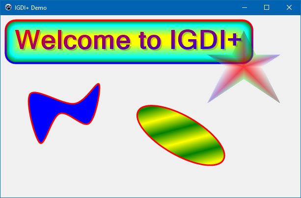

# IGDIPlusMod

The free and open source library for Delphi and Free Pascal (Lazarus & CodeTyphon). It allows quick and easy implementations of complex GDI+ applications, in a natural Pascal-friendly code.

---

## IGDIPlus

Author: Boian Mitov  
Home page: http://mitov.com

---

## Original license

http://mitov.com/products/igdi+#license

This software is provided 'as-is', without any express or
implied warranty.  In no event will the author be held liable
for any  damages arising from the use of this software.

Permission is granted to anyone to use this software for any
purpose, including commercial applications, and to alter it
and redistribute it freely, subject to the following
restrictions:

1. The origin of this software must not be misrepresented,
  you must not claim that you wrote the original software.
  If you use this software in a product, an acknowledgment
  in the product documentation would be appreciated but is
  not required.

2. Altered source versions must be plainly marked as such, and
  must not be misrepresented as being the original software.

3. This notice may not be removed or altered from any source
  distribution.

---

## License for my mods

You can do with my code whatever you want without any cost and without any limitations.

---

## My modifications

- Free Pascal support.
- New files: `IGDIPlusHelpers.pas`, `IGDIPlusAPI_FPC.inc`.
- New demo: Color Wheel

Required FPC version 3.0.2 or newer!  
Tested with FPC ver. 3.3.1 (trunk), 3.1.1, 3.0.4, 3.0.2. FPC 3.0.0 - fail!

---

## Screenshots

Original IGDIPlus demo application compiled with Lazarus.



---

Additional demo - Color Wheel


---

## Example

Demo 1 main procedure.

```delphi
procedure TForm1.FormPaint(Sender: TObject);
var
  AGraphics       : IGPGraphics;
  AFont           : IGPFont;
  ALeftTopCorner  : TPointF;
  ARect           : TIGPRectF;
  ARect1          : TIGPRectF;
  APath           : IGPGraphicsPath;
begin
  AGraphics := TIGPGraphics.Create( Canvas );
  AGraphics.SmoothingMode := SmoothingModeAntiAlias;
  AGraphics.TextRenderingHint := TextRenderingHintAntiAlias;

  ALeftTopCorner := TPointF.Create( 20, 20 );
  AFont := TIGPFont.Create( 'Microsoft Sans Serif', 40, [ fsBold ] );
  ARect := AGraphics.GetStringBoundingBoxF( 'Welcome to IGDI+', AFont, ALeftTopCorner );
  ARect1 := GPInflateRectF( ARect, 10, 10 );

  // Draw a fancy rounded rectangle.
  AGraphics.DrawRoundRectangleF(
              TIGPPen.Create( TIGPLinearGradientBrush.Create( GPInflateRectF( ARect1, 2, 2 ), aclRed, aclBlue, LinearGradientModeVertical ), 4 ),
              TIGPPathGradientBrush.Create(
                  TIGPGraphicsPath.Create().AddRoundRectangleF( ARect1, TIGPSizeF.Create( 20, 20 ) )
                   )
                .SetInterpolationColorArrays( [ aclGreen, aclCyan, aclYellow ], [ 0, 0.3, 1 ] )
                .SetCenterPointF( TPointF.Create( 250, 50 ))
                .SetFocusScales( 0.87, 0.2 ),
              ARect1, TIGPSizeF.Create( 20, 20 ) );

  // Draw a text with semitransparent shadow.
  AGraphics.DrawStringF( 'Welcome to IGDI+',
                        AFont,
                        TPointF.Create( 23, 23 ),
                        TIGPSolidBrush.Create( MakeARGBColor( 50, aclBlack )) )

           .DrawStringF( 'Welcome to IGDI+',
                        AFont,
                        ALeftTopCorner,
                        TIGPLinearGradientBrush.Create( ARect, aclRed, aclBlue, LinearGradientModeForwardDiagonal ));


  // Draw a closed curve.
  AGraphics.DrawClosedCurveF( TIGPPen.Create( aclRed, 3 ), TIGPSolidBrush.Create( aclBlue ),
              [
              TPointF.Create( 60,  160 ),
              TPointF.Create( 150, 180 ),
              TPointF.Create( 200, 140 ),
              TPointF.Create( 180, 220 ),
              TPointF.Create( 120, 200 ),
              TPointF.Create( 80,  260 )
              ] );

  // Draw a semitransparent star.
  APath := TIGPGraphicsPath.Create();
  APath.AddLinesF(
    [
    TPointF.Create( 75, 0 ),
    TPointF.Create( 100, 50 ),
    TPointF.Create( 150, 50 ),
    TPointF.Create( 112, 75 ),
    TPointF.Create( 150, 150 ),
    TPointF.Create( 75, 100 ),
    TPointF.Create( 0, 150 ),
    TPointF.Create( 37, 75 ),
    TPointF.Create( 0, 50 ),
    TPointF.Create( 50, 50 )
     ] );

  AGraphics.TranslateTransform( 420, 30 )
           .FillPath(
              TIGPPathGradientBrush.Create( APath )
                .SetCenterColor( MakeColor( 200, 255, 0, 0))
                .SetSurroundColors(
                  [
                  MakeColor(80, 0, 0, 0),
                  MakeColor(80, 0, 255, 0),
                  MakeColor(80, 0, 0, 255),
                  MakeColor(80, 255, 255, 255),
                  MakeColor(80, 0, 0, 0),
                  MakeColor(80, 0, 255, 0),
                  MakeColor(80, 0, 0, 255),
                  MakeColor(80, 255, 255, 255),
                  MakeColor(80, 0, 0, 0),
                  MakeColor(80, 0, 255, 0)
                  ] ),

              APath );

  // Draw rotated ellipse.
  AGraphics.ResetTransform()
           .TranslateTransform( 300, 160 )
           .RotateTransform( 30 )
           .DrawEllipseF(
              TIGPPen.Create( aclRed, 3 ),
              TIGPLinearGradientBrush.Create( TPointF.Create( 0, 0 ), TPointF.Create( 20, 20 ), aclYellow, aclGreen )
              .SetWrapMode( WrapModeTileFlipX ),
              0, 0, 200, 80 );
end;
```

---

## Changelog

15.01.2020  
Initial release with Free Pascal support.
